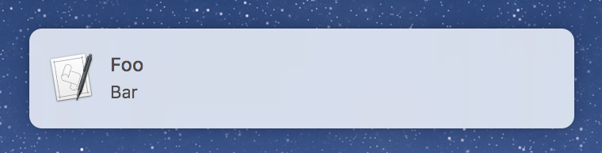

# notify-go

Create desktop notifications in MacOS with Go.



## Usage

```go
message := &notify.Message{
  Title: "Foo",
  Body:  "Bar",
}

err := notify.Alert(message)
if err != nil {
  panic(err)
}
```
